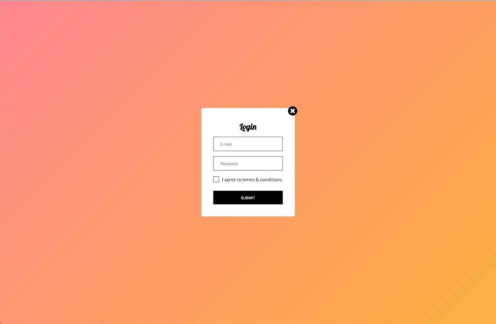
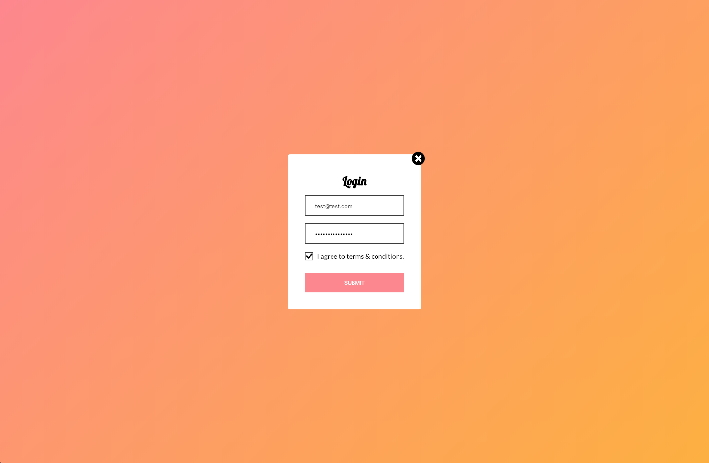

# Virtua Frontend Internship Test
Recruitment test for frontend internship. Good luck! :)

## Rules
* Fork this repository, so it can stay on Github
* Commit your changes after every task
* When you finish, send us link to your repository and wait for an answer

## Prerequisites
- [Node.js](https://nodejs.org/en/)
- [npm](https://www.npmjs.com/get-npm)
- [Gulp](https://gulpjs.org/getting-started.html)


## Installation
Bring up a terminal, then go to your project root directory and install local dependencies:

```npm install```

To start local dev server, type in the following command in your terminal:

```gulp```

You should now see the working project page on http://localhost:8080, with a beautiful gradient background and engaging yet mysterious button :)


## Tasks
Use SCSS to write your styles in /src/scss directory. Add your JS code to /src/js/index.js file.

### Task 1
After clicking on *Click me* button, popup with login form should appear. Add HTML code and style it accordingly to the design. Please notice, that popup should have a working close button.



### Task 2
Add simple JS validation to form created earlier. Submit button should have hover effect that changes it's background color. Please notice checkbox's custom look.



### Task 3
After submitting the form, popup should disappear after 3 seconds and instead of *Click me* button, there should be displayed *Thank you!* success message, as on the project.


## Send us your repo!
After finishing all tasks, send us link to your repo at [jobs@wearevirtua.com](mailto:jobs@wearevirtua.com).
